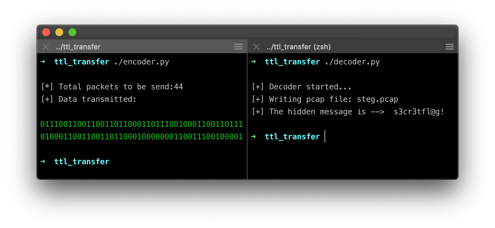
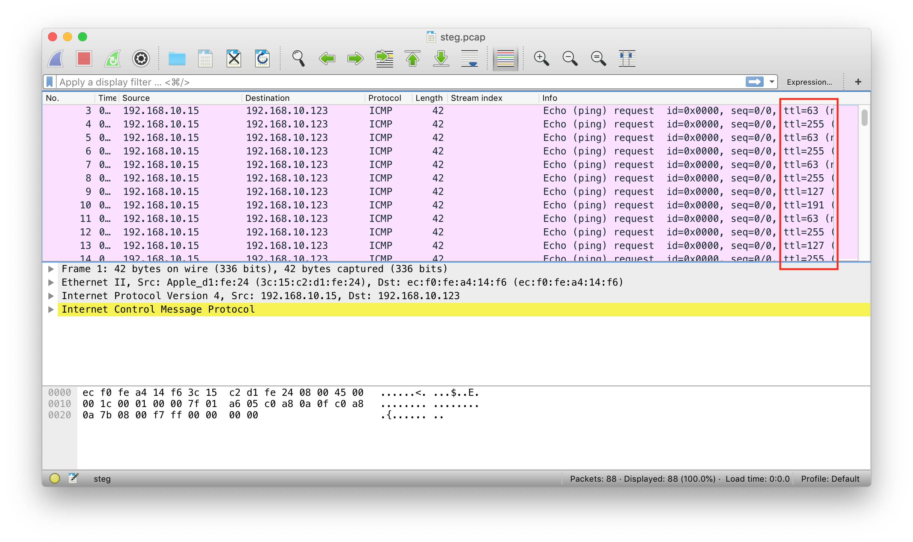

# NETsteg: Network-layer Steganography 
[](https://github.com/chrispetrou/NETsteg/blob/master/LICENSE)

### What is it?

The above scripts are a PoC of a steganographic method which
is used for hiding and transmitting data in the `Network Layer` 
of an application using some most-significant-bits (_msbs_) in the Time-To-Live (_TTL_) field in the IP header.

I inspired and adapted the idea from `Chet Hosmer & Michael Raggo`, which is described in their [book](https://www.amazon.com/Data-Hiding-Concealed-Multimedia-Operating/dp/1597497436) with the title *"Data Hiding: Exposing Concealed Data in Multimedia, Operating Systems, Mobile Devices and Network Protocols"*.

### Some background

TTL is an 8-bit field in the ip header. That means its values can range from 0 - 255 or in binary from `00000000` to `11111111`.  But `IPv4` is a best effort protocol. This in combination with the expansion of the internet makes kind of unnecessary to make use of all 8-bits provided for the TTL-field.

So what if we used only the 6 lsbs of the 8 bits provided for the ttl and use the 2 msbs for data. This could surprisingly work cause the worst case of `TTL = 00111111 = 63 hops` is enough for the modern networks to operate (_some operating systems also use 64 as the initial default value for the TTL field_).

In this way the 8-bit TTL field would look like this:

```
 XX 111111
```

So the two msbs are used for data hiding and the remaining 
six lsbs are used for the least TTL value.

So what if we wanted to secretly transmit the word: __s3cr3tfl@g!__

1.  The first step is to take every ascii character in the above text and transform it to its hex equivalent.
2.  Then break the hex equivalent into `2-bit` chunks.
3.  Finally transmit every 2-bit chunk in the 2 msbs of the `TTL` field.

In this way the receiver would then extract the binary data from the **TTL-field** of each packet, which in this case are:

```
0111001100110011011000110111001000110011011101000110011001101100010000000110011100100001
```

and then would translate them into ascii text.

### **Python Implementation**

The implementation is broken in two parts:
* The `encoder.py` which is used to transmit the data using the above technique
* And the `decoder.py` which is the receiver

> __Note:__ The code is very simple and is only to demonstrate the basic idea. Of course it could easily be adapted for more complex scenarios.

### How to detect?

A simple detection heuristic would be to observe the traffic and try to identify if between two (_or even more_) IPs the TTL-field takes specific discrete values.

### Scripts in action:



>   And if we observe the __steg.pcac__ file produced by the __decoder.py__ script, we see that it actually looks like a simple ping traffic with the only difference that the TTL values get changed very often and take only `4 different values` (the ttl takes only 4 different values because we use two msbs for data, so `2^2=4`).



### Requirements:

To install the requirements:

`pip install -r requirements.txt --upgrade --user`

## References
*   Raggo, M.T. and Hosmer, C., 2012. Data hiding: exposing concealed data in multimedia, operating systems, mobile devices and network protocols. Newnes.

## License

This project is licensed under the GPLv3 License - see the [LICENSE](LICENSE) file for details
